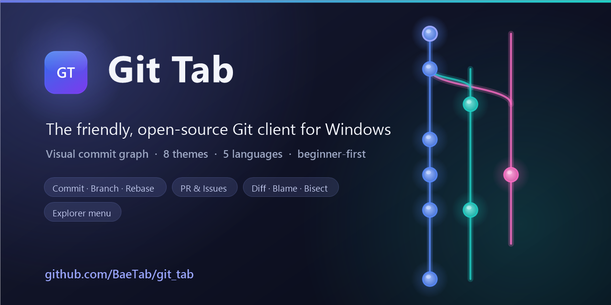

<p align="center">
  
</p>

<h1 align="center">Git Tab</h1>

<p align="center"><b>A modern Windows Git client with a color-coded commit graph, built in .NET 8 &amp; WPF.</b></p>

<p align="center"><a href="#english">English</a> | <a href="#한국어">한국어</a></p>

---

> ### ⚠️ On v1.4.1 or earlier? A one-time manual update is required
> Those builds have an auto-updater bug (it locked the downloaded installer while verifying it), so
> in-app updates fail with *"Couldn't check for updates."* Fixed in **v1.4.2** — but since the fix
> ships in the new version, please **[download the latest installer manually](https://github.com/BaeTab/git_tab/releases/latest)** once.
> Auto-update works normally afterward.
>
> **v1.4.1 이하 사용자는 이번 한 번만 수동 업데이트가 필요합니다.** (자동 업데이터 버그로 인앱 업데이트가
> "업데이트를 확인하지 못했어요"로 실패 → v1.4.2에서 수정. [최신 설치본 직접 내려받기](https://github.com/BaeTab/git_tab/releases/latest))

---

## English

[](https://github.com/BaeTab/git_tab/actions/workflows/build.yml)
[](LICENSE)
[](https://dotnet.microsoft.com/en-us/download/dotnet/8.0)

### What is Git Tab?

Git Tab is a native Windows Git client that brings the power of **visual branch management** to your fingertips. Like GitKraken and SourceTree, Git Tab renders commits as an interactive, color-coded graph where branches "braid" together—making it easy to understand your repository's history at a glance. Built entirely in C# with WPF, Git Tab is lightweight, fast, and deeply integrated with Windows.

> 📖 **New to Git?** The beginner-friendly **[Wiki](docs/wiki/Home.md)** walks you through installation, Git basics, authentication, and every feature in plain language.

### Features

- **Color Commit Graph** — Branches get distinct colors; commits line up in a virtualized, interactive graph that handles tens of thousands of commits without lag.
- **Commit Details & Diff** — Message, author, date, changed files, and a colored **unified or side-by-side** diff (AvalonEdit) with **word-level highlighting** of the exact words that changed.
- **Diff moved-code detection** — blocks of code deleted in one place and re-added elsewhere now highlight as *moved* (blue/violet) instead of plain red/green, like `git`'s color-moved.
- **Open diff in its own window** — pop-out diffs to a resizable window with F11 fullscreen support.
- **Staging & Commit** — Stage/unstage/discard individual files and commit (or amend) from the UI.
- **Branches & Tags** — Checkout, create, delete, rename, merge, rebase; create/delete/push tags; delete remote branches.
- **Interactive Rebase** — Reorder, squash, fixup, or drop commits with a visual planner.
- **Reword & Bisect** — Rewrite any commit's message, and binary-search for a bad commit (Good / Bad / Skip) right from the graph.
- **Signing** — GPG/SSH-sign commits and tags, with a verified-signature badge in commit details.
- **Power tools** — Worktrees, Git LFS, richer submodules, patch import/export, **line-level staging**, sparse checkout + blobless clone, and a saved-credentials manager — all in one overflow menu.
- **Multiple repository tabs** — open several repos and switch between them; folder-grouped file lists, image diffs, clickable `#123`/URLs in messages, an ignore-whitespace toggle, and merged-branch pruning.
- **Hosting integration** — browse open pull requests/issues in-app and post/view comments for GitHub and GitLab, see a commit's CI status, and open the repo or a file in **VS Code** / an external diff tool.
- **Convenience & management** — force-push (with lease), sign-off & co-author trailers, edit commit author, restore a file to an old version, a repository-statistics dashboard, a Git config editor, and "add to .gitignore".
- **More productivity** — expand/collapse diff context, generate a CHANGELOG from Conventional Commits, bookmark commits, and browse changed files as a folder tree.
- **History & Undo** — Browse HEAD's reflog and restore to any point; one-click "undo last action".
- **Partial Staging** — Stage individual hunks of a file (the GUI equivalent of `git add -p`).
- **Visual 3-Way Merge** — Resolve conflicts with base / ours / theirs panes and an editable result.
- **Create / Clone / Remotes** — `git init` a new repo, **clone** from a URL, and manage remotes.
- **File History** — the commits that touched a file, with the diff at each.
- **Compare** — diff two branches, tags, or commits.
- **Content Search (pickaxe)** — find where a string was added or removed in the code.
- **Command Palette** — `Ctrl+P` for quick access to every action.
- **GitHub/GitLab** — One-click "New PR" (opens the pre-filled Pull/Merge Request page) and "Open on web".
- **Commit Helper** — A Conventional-Commits type dropdown for consistent messages.
- **Stash** — Stash your changes and apply/pop/drop them later.
- **Blame** — See which commit last changed each line of a file.
- **Conflict Handling** — An in-progress banner with Abort/Continue; resolve by staging files.
- **Remotes** — Fetch, pull, push with ahead/behind tracking; long network operations are cancellable.
- **GUI Authentication** — Push/pull to private HTTPS remotes with no console setup: enter a username + Personal Access Token once in a dialog, stored securely in Windows Credential Manager and reused automatically.
- **Windows Explorer Integration** — TortoiseGit-style right-click menu (**Open / Clone / Commit / Pull / Push / Fetch / Stash / History**) on any folder. Pull/Push/Fetch/Commit/Stash open in a dedicated dialog (no need to open the full app); Open/Clone/History launch the main window. Toggle it from **Settings** (no admin needed).
- **Bundled Git** — The installer ships portable Git, so Git Tab is a true all-in-one tool that works even without Git installed separately.
- **Submodules** — One-click `submodule update --init --recursive`.
- **`.gitignore` Generator** — Detects your stack (.NET, Node, Python, Java, Rust, Go, Flutter, Unity…) and generates a matching file.
- **Right-click Context Menus** — In-app TortoiseGit-style menus on commits, branches, and files.
- **Commit Search** — Filter by message, author, or hash in real time.
- **Light & Dark Themes + 5 UI Languages** — Korean, English, Japanese, Chinese (Simplified), Spanish; toggle at runtime, remembered across restarts; beginner-friendly tooltips explain every Git action.
- **Accessibility** — High-contrast theme and UI/text zoom (100–150%) in Settings.
- **Customizable Keyboard Shortcuts** — Rebind any shortcut with live key-chord capture, conflict detection, and reset-to-default; includes F5/Ctrl+R refresh, Ctrl+O open, Ctrl+Enter commit.
- **Auto-Update** — Checks GitHub Releases and installs new versions in one click; opt in to a beta channel for pre-release builds in Settings.

### Screenshots

**Dark Theme:**


**Light Theme:**


**Theme gallery** — eight built-in themes; pick one from the toolbar palette menu or in Settings:

<table>
<tr>
<td align="center"><b>Dark</b><br></td>
<td align="center"><b>Light</b><br></td>
</tr>
<tr>
<td align="center"><b>Midnight</b><br></td>
<td align="center"><b>Nord</b><br></td>
</tr>
<tr>
<td align="center"><b>Dracula</b><br></td>
<td align="center"><b>Solarized</b><br></td>
</tr>
<tr>
<td align="center"><b>Rosé Pine</b><br></td>
<td align="center"><b>High Contrast</b><br></td>
</tr>
</table>

### Requirements

- **Windows 10 or Windows 11**
- **.NET 8 Desktop Runtime** ([download](https://dotnet.microsoft.com/en-us/download/dotnet/8.0))
- **Git** — bundled with the installer, so no separate install is needed. Git Tab auto-detects a system Git (PATH or standard install) if you prefer to use your own.

### Build from Source

#### 1. Clone the Repository

```bash
git clone https://github.com/BaeTab/git_tab.git
cd git_tab
```

#### 2. Build the Solution

```bash
dotnet build GitTab.sln -c Release
```

#### 3. Run Tests

```bash
dotnet test GitTab.sln
```

#### 4. Run the App

```bash
dotnet run --project src/GitTab.App
```

#### Solution Structure

```
GitTab.sln
├── src/
│   ├── GitTab.Core/              # Domain models, git adapters (LibGit2Sharp, git.exe)
│   ├── GitTab.Graph/             # Pure lane-layout algorithm for the commit graph
│   ├── GitTab.Graph.Cli/         # ASCII harness for graph validation
│   └── GitTab.App/               # WPF application (MVVM via CommunityToolkit.Mvvm)
└── tests/
    ├── GitTab.Graph.Tests/       # Unit tests for lane algorithm
    └── GitTab.Core.Tests/        # Unit tests for domain & adapters
```

### Architecture

Git Tab is split into clean, testable layers:

- **GitTab.Core** — Domain models (Repository, Commit, Branch, Remote, etc.) and two Git adapters:
  - *LibGit2Sharp* adapter for read-only operations (fast, in-process)
  - *git.exe* facade for all writes and network operations (push, pull, merge, rebase, etc.)
- **GitTab.Graph** — A pure, UI-agnostic algorithm that arranges commits into colored lanes. No WPF or external dependencies; easily unit-tested.
- **GitTab.App** — A WPF application using MVVM (via `CommunityToolkit.Mvvm`) that wires up the domain, graph algorithm, and UI. Dependency injection via `Microsoft.Extensions.DependencyInjection`; logging via Serilog.

This separation ensures that Core and Graph are fully testable in isolation and can be reused in other clients (CLI, web, etc.).

### Running the Tests

```bash
dotnet test GitTab.sln
```

Tests use **xUnit** and **FluentAssertions** for readable, expressive test code. Coverage includes the lane-layout algorithm (10+ unit tests), domain models, and adapter behavior.

### Install

Download the latest **InnoSetup installer** from the [GitHub Releases page](https://github.com/BaeTab/git_tab/releases) and run it. The installer will:
- Install Git Tab to `Program Files\Git Tab`
- Create a Start Menu shortcut
- Verify that .NET 8 Desktop Runtime is installed

**Auto-Update:** After installation, Git Tab will periodically check GitHub Releases. When a new version is available, you'll be prompted to download and install it with a single click.

### Third-Party Licenses

Git Tab depends on several excellent open-source projects. See [THIRD-PARTY-NOTICES.md](THIRD-PARTY-NOTICES.md) for full details and license texts.

| Package | Version | License |
|---------|---------|---------|
| LibGit2Sharp | 0.31.0 | MIT |
| CommunityToolkit.Mvvm | 8.4.0 | MIT |
| ICSharpCode.AvalonEdit | 6.3.0.90 | MIT |
| Microsoft.Extensions.DependencyInjection | 8.0.x | MIT |
| Microsoft.Extensions.Logging | 8.0.x | MIT |
| Serilog | 4.2.0 | Apache-2.0 |
| Serilog.Extensions.Logging | 8.0.0 | Apache-2.0 |
| Serilog.Sinks.File | 6.0.0 | Apache-2.0 |

### Contributing

We welcome contributions! See [CONTRIBUTING.md](CONTRIBUTING.md) for setup instructions, architecture overview, and coding conventions. Keep the build and tests green (`dotnet build` and `dotnet test` must pass, zero warnings), and ensure CI passes before opening a pull request. Have an idea? Open an issue on the [Issues](https://github.com/BaeTab/git_tab/issues) page.

### License

Git Tab is released under the **MIT License**. See [LICENSE](LICENSE) for details.

© 2026 Hyun-woo Bae (H.Soft)

---

## 한국어

[](https://github.com/BaeTab/git_tab/actions/workflows/build.yml)
[](LICENSE)
[](https://dotnet.microsoft.com/en-us/download/dotnet/8.0)

### Git Tab란?

Git Tab는 **시각적 브랜치 관리**의 힘을 제공하는 네이티브 Windows Git 클라이언트입니다. GitKraken과 SourceTree처럼, Git Tab는 커밋을 색상으로 구분된 인터랙티브 그래프로 렌더링하며, 브랜치들이 함께 "꼰다(braid)"는 개념으로 저장소의 히스토리를 한눈에 파악할 수 있습니다. C#과 WPF로 완전히 작성되었으며 가볍고 빠르며 Windows와 깊게 통합됩니다.

> 📖 **Git이 처음이신가요?** 초보자용 **[위키](docs/wiki/Home.md)**에서 설치·Git 기초·인증·모든 기능을 쉬운 말로 안내합니다.

### 주요 기능

- **색상 커밋 그래프** — 각 브랜치에 고유 색상; 가상화된 그래프로 수만 개의 커밋도 지연 없이 처리합니다.
- **커밋 상세 & Diff** — 메시지·작성자·날짜·변경 파일과 색상 **통합/좌우 비교(side-by-side)** diff (AvalonEdit), **바뀐 단어만 강조**하는 word-level 하이라이트.
- **Diff 이동 코드 감지(moved-code detection)** — 한 곳에서 삭제되고 다른 곳에서 다시 추가된 코드 블록이 *이동*(파랑/보라)으로 표시됨, `git`의 color-moved처럼.
- **Diff를 별도 창에서 열기** — diff 툴바의 팝아웃 버튼으로 별도 창에 열고 F11으로 전체 화면 지원.
- **스테이징 & 커밋** — 파일 단위 스테이징/언스테이징/되돌리기, 커밋(및 amend).
- **브랜치 & 태그** — 체크아웃·생성·삭제·이름변경·병합·리베이스, 태그 생성/삭제/푸시, 원격 브랜치 삭제.
- **대화형 리베이스** — 커밋을 재정렬·squash·fixup·drop 하는 시각적 플래너.
- **메시지 수정(reword) & 이분 탐색(bisect)** — 커밋 메시지를 다시 쓰고, Good/Bad/Skip 으로 버그 커밋을 이분 탐색 — 그래프에서 바로.
- **서명(signing)** — 커밋·태그를 GPG/SSH로 서명하고, 커밋 상세에 서명 확인 뱃지 표시.
- **파워 도구** — 워크트리, Git LFS, 서브모듈 심화, 패치 내보내기/적용, **라인 단위 스테이징**, 스파스 체크아웃 + blobless 복제, 저장된 자격증명 관리 — 모두 오버플로(≡) 메뉴에.
- **다중 저장소 탭** — 여러 저장소를 탭으로 열고 전환. 폴더별 파일 그룹, 이미지 diff, 커밋 메시지의 `#123`·URL 클릭, 공백 무시 토글, 병합된 브랜치 정리.
- **호스팅 연동** — 앱 안에서 PR·이슈 목록 조회 및 GitHub/GitLab에서 댓글 보기·작성, 커밋 CI 상태 표시, 저장소/파일을 **VS Code**·외부 diff 도구로 열기.
- **편의·관리 기능** — 안전 강제 푸시(force-with-lease), Sign-off·공동작성자 트레일러, 작성자 수정, 파일을 옛 버전으로 되돌리기, 저장소 통계 대시보드, Git 설정 편집기, ".gitignore에 추가".
- **생산성 도구** — diff 컨텍스트 확장/축소, Conventional Commits로 CHANGELOG 생성, 커밋 북마크, 변경 파일 폴더 트리.
- **작업 기록 & 되돌리기** — HEAD reflog를 훑어보고 원하는 지점으로 복원, 원클릭 ‘마지막 작업 취소’.
- **부분 스테이징** — 파일의 헝크(변경 블록) 단위로 스테이지 (GUI판 `git add -p`).
- **시각적 3-way 병합** — base/ours/theirs 참조 패널 + 편집 가능한 결과로 충돌 해결.
- **만들기 / 복제 / 원격** — `git init` 새 저장소, URL에서 **복제(clone)**, 원격 추가/변경/삭제.
- **파일 히스토리** — 파일을 건드린 커밋들과 각 커밋의 diff.
- **비교(Compare)** — 두 브랜치·태그·커밋 사이 diff.
- **내용 검색(pickaxe)** — 코드에서 문자열이 언제 추가·삭제됐는지 찾기.
- **명령 팔레트** — `Ctrl+P`로 모든 액션 빠른 실행.
- **GitHub/GitLab** — 원클릭 ‘PR 만들기’(미리 채워진 PR/MR 페이지 열기), ‘웹에서 열기’.
- **커밋 도우미** — Conventional Commits 종류 드롭다운으로 일관된 메시지.
- **스태시** — 변경을 잠시 치워두고 나중에 apply/pop/drop.
- **Blame** — 파일의 각 줄을 마지막으로 바꾼 커밋 표시.
- **충돌 처리** — 진행 중 배너(중단/계속), 파일을 스테이지하여 해결.
- **원격** — Fetch/Pull/Push + ahead/behind 추적, 진행 중 작업 취소 가능.
- **GUI 인증** — 콘솔 설정 없이 비공개 HTTPS 원격에 Push/Pull. 사용자 이름 + 개인 액세스 토큰(PAT)을 한 번만 대화상자에 입력하면 Windows 자격 증명 관리자에 안전하게 저장되어 이후 자동으로 사용됩니다.
- **Windows 탐색기 통합** — 아무 폴더나 우클릭하면 TortoiseGit 스타일 메뉴(**열기 / 복제 / 커밋 / 받아오기 / 올리기 / 가져오기 / 스태시 / 히스토리**)가 나옵니다. 받아오기·올리기·가져오기·커밋·스태시는 전용 대화상자로 바로 열려(메인 앱을 열 필요 없음), 열기·복제·히스토리는 메인 창을 엽니다. **설정**에서 켜고 끌 수 있습니다(관리자 권한 불필요).
- **Git 번들 포함** — 설치본에 이식형 Git이 포함되어, Git이 따로 설치돼 있지 않아도 동작하는 진정한 올인원 도구입니다.
- **서브모듈** — 원클릭 `submodule update --init --recursive`.
- **.gitignore 생성기** — 스택 자동 감지(.NET·Node·Python·Java·Rust·Go·Flutter·Unity 등) 후 생성.
- **우클릭 컨텍스트 메뉴** — 앱 내 TortoiseGit 스타일(커밋·브랜치·파일).
- **커밋 검색** — 메시지·작성자·해시로 실시간 필터링.
- **라이트/다크 테마 + 5가지 UI 언어** — 한국어, 영어, 일본어, 중국어(간체), 스페인어; 런타임 전환, 재시작 후에도 기억; 모든 동작에 초보자 친화 툴팁.
- **접근성** — 고명도 테마와 UI/텍스트 확대(100–150%) 설정에서 제공.
- **사용자 정의 단축키** — 모든 단축키 재바인딩 가능(실시간 키-코드 캡처, 충돌 감지, 기본값 초기화); F5/Ctrl+R 새로고침, Ctrl+O 열기, Ctrl+Enter 커밋 포함.
- **자동 업데이트** — GitHub Releases 확인 후 한 클릭 설치; 설정에서 베타 채널을 선택하면 프리릴리스 빌드 수신 가능.

### 스크린샷

**다크 테마:**


**라이트 테마:**


**테마 갤러리** — 8종 내장 테마. 툴바 팔레트 메뉴 또는 설정에서 선택하세요:

<table>
<tr>
<td align="center"><b>Dark</b><br></td>
<td align="center"><b>Light</b><br></td>
</tr>
<tr>
<td align="center"><b>Midnight</b><br></td>
<td align="center"><b>Nord</b><br></td>
</tr>
<tr>
<td align="center"><b>Dracula</b><br></td>
<td align="center"><b>Solarized</b><br></td>
</tr>
<tr>
<td align="center"><b>Rosé Pine</b><br></td>
<td align="center"><b>High Contrast</b><br></td>
</tr>
</table>

### 시스템 요구사항

- **Windows 10 또는 Windows 11**
- **.NET 8 Desktop Runtime** ([다운로드](https://dotnet.microsoft.com/en-us/download/dotnet/8.0))
- **Git** — 설치본에 포함되어 별도 설치가 필요 없습니다. 직접 설치한 Git이 있으면(PATH·표준 설치 경로) 자동으로 감지해 사용합니다.

### 소스에서 빌드

#### 1. 저장소 복제

```bash
git clone https://github.com/BaeTab/git_tab.git
cd git_tab
```

#### 2. 솔루션 빌드

```bash
dotnet build GitTab.sln -c Release
```

#### 3. 테스트 실행

```bash
dotnet test GitTab.sln
```

#### 4. 앱 실행

```bash
dotnet run --project src/GitTab.App
```

#### 솔루션 구조

```
GitTab.sln
├── src/
│   ├── GitTab.Core/              # 도메인 모델, git 어댑터 (LibGit2Sharp, git.exe)
│   ├── GitTab.Graph/             # 커밋 그래프 레인 배치 알고리즘 (순수 함수)
│   ├── GitTab.Graph.Cli/         # 그래프 검증용 ASCII 도구
│   └── GitTab.App/               # WPF 애플리케이션 (CommunityToolkit.Mvvm MVVM)
└── tests/
    ├── GitTab.Graph.Tests/       # 레인 배치 알고리즘 단위 테스트
    └── GitTab.Core.Tests/        # 도메인 & 어댑터 단위 테스트
```

### 아키텍처

Git Tab는 깔끔하고 테스트 가능한 계층으로 분리됩니다:

- **GitTab.Core** — 도메인 모델(Repository, Commit, Branch, Remote 등)과 두 가지 Git 어댑터:
  - *LibGit2Sharp* 어댑터: 읽기 전용 작업 (빠르고 in-process)
  - *git.exe* 파사드: 모든 쓰기 및 네트워크 작업 (push, pull, merge, rebase 등)
- **GitTab.Graph** — 순수하고 UI에 무관한 알고리즘으로 커밋을 색상 레인으로 정렬합니다. WPF나 외부 의존성 없음; 단위 테스트 가능.
- **GitTab.App** — MVVM을 사용하는 WPF 애플리케이션(`CommunityToolkit.Mvvm`으로 구성). `Microsoft.Extensions.DependencyInjection`으로 DI; Serilog으로 로깅.

이러한 분리는 Core와 Graph가 완전히 격리된 상태에서 테스트 가능하며 다른 클라이언트(CLI, 웹 등)에서 재사용 가능하도록 합니다.

### 테스트 실행

```bash
dotnet test GitTab.sln
```

테스트는 **xUnit**과 **FluentAssertions**을 사용하여 읽기 쉽고 표현력 있는 테스트 코드를 작성합니다. 레인 배치 알고리즘(10개 이상의 단위 테스트), 도메인 모델, 어댑터 동작을 포함합니다.

### 설치

[GitHub Releases 페이지](https://github.com/BaeTab/git_tab/releases)에서 최신 **InnoSetup 설치 프로그램**을 다운로드하고 실행합니다. 설치 프로그램은 다음을 수행합니다:
- Git Tab를 `Program Files\Git Tab`에 설치
- 시작 메뉴 바로가기 생성
- .NET 8 Desktop Runtime이 설치되어 있는지 확인

**자동 업데이트:** 설치 후 Git Tab는 정기적으로 GitHub Releases를 확인합니다. 새 버전이 있으면 한 번의 클릭으로 다운로드 및 설치할 수 있습니다.

### 제3자 라이센스

Git Tab는 여러 우수한 오픈소스 프로젝트에 의존합니다. 자세한 내용과 라이센스 텍스트는 [THIRD-PARTY-NOTICES.md](THIRD-PARTY-NOTICES.md)를 참조하세요.

| 패키지 | 버전 | 라이센스 |
|--------|------|---------|
| LibGit2Sharp | 0.31.0 | MIT |
| CommunityToolkit.Mvvm | 8.4.0 | MIT |
| ICSharpCode.AvalonEdit | 6.3.0.90 | MIT |
| Microsoft.Extensions.DependencyInjection | 8.0.x | MIT |
| Microsoft.Extensions.Logging | 8.0.x | MIT |
| Serilog | 4.2.0 | Apache-2.0 |
| Serilog.Extensions.Logging | 8.0.0 | Apache-2.0 |
| Serilog.Sinks.File | 6.0.0 | Apache-2.0 |

### 기여하기

기여를 환영합니다! [CONTRIBUTING.md](CONTRIBUTING.md)에서 설정, 아키텍처, 코딩 규약을 확인하세요. 빌드와 테스트를 유지하고(`dotnet build`와 `dotnet test` 통과, 경고 0개), PR 전 CI를 통과하세요. 아이디어가 있으신가요? [Issues](https://github.com/BaeTab/git_tab/issues) 페이지에서 이슈를 열어주세요.

### 라이센스

Git Tab는 **MIT 라이센스** 하에 배포됩니다. 자세한 내용은 [LICENSE](LICENSE)를 참조하세요.

© 2026 Hyun-woo Bae (H.Soft)
